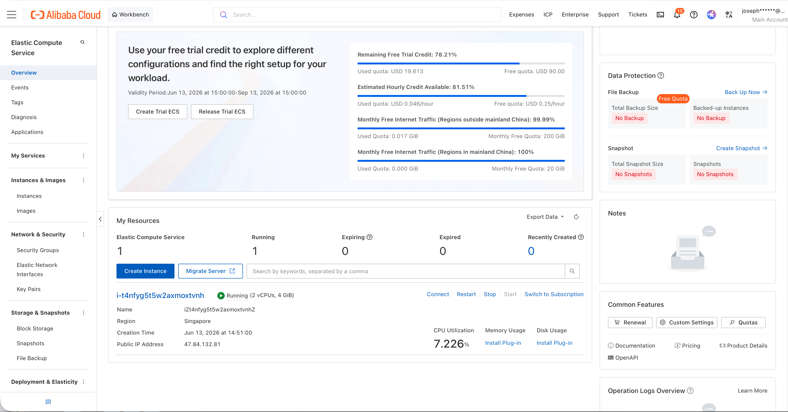
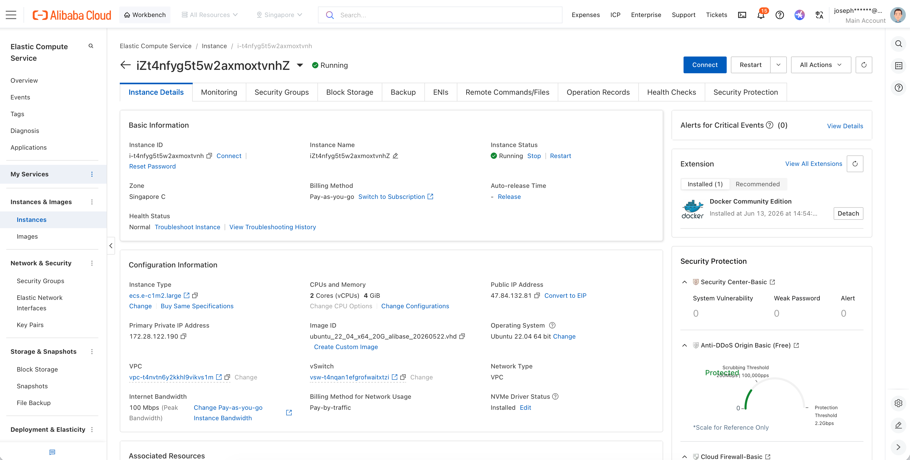

# AI Growth Doctor

AI Growth Doctor is a multi-agent operating copilot for reading daily product growth signals and turning them into a concrete, evidence-backed operating decision.

The system is designed as an **Agent Society**, not a single general-purpose AI answer. Deterministic services first extract the metrics and safe context. Specialist agents then analyze separate growth domains with bounded system awareness, pass their outputs through adaptive structured negotiation, and send a reviewable evidence package to a Final Decision Agent.

Before the Agent Society reads the data, app-specific source metrics are mapped into a **Generic Growth Metric Contract**. Hitung Kalori remains the real aggregated case study, but metrics such as `food_add_success` are normalized into reusable concepts such as `activation.core_action_success_users`.

Default app profile and metric mapping are defined in:

```text
config/ai_growth_doctor.php
```

The goal is not to automate business decisions blindly. The goal is to make the daily growth decision clearer, safer, and easier for a human operator to review.

## Judge Quick Check

Live demo:

```text
https://agd.hitungkalori.com
```

## HTTP Basic Auth

```text
Username: judge
Password: AGD-qwen
```

The hosted demo is protected with HTTP Basic Auth. Use the judge/demo credentials provided with the submission to access the live URL.

## Alibaba Cloud Deployment Proof

Short deployment proof recording:

Visual evidence:




```text
https://youtu.be/Q7RbNFY5t1Y
```

This recording is separate from the main product demo and demonstrates that the AI Growth Doctor backend is running on Alibaba Cloud ECS.

Alibaba Cloud services used by this project:

- Alibaba Cloud ECS for hosting the Laravel backend.
- Alibaba Cloud Qwen / DashScope OpenAI-compatible API for LLM agent execution.

Code references demonstrating Alibaba Cloud / Qwen API usage:

```text
app/Services/GrowthDoctor/Agents/AiAgentClient.php
config/services.php
config/ai_growth_doctor.php
```

The Qwen / DashScope endpoint is configured through environment variables such as `AI_PROVIDER`, `QWEN_BASE_URL`, and `QWEN_DEFAULT_MODEL`.

## What It Answers

AI Growth Doctor helps answer questions such as:

- Is the app healthy today?
- Is the main issue activation, retention, monetization, release/version quality, ads, or forecast risk?
- Is it safe to scale acquisition?
- Should the operator hold, optimize, or run only a small controlled test?
- Which metrics should be watched over the next 24 to 72 hours?
- Which recommendations were blocked by deterministic guardrails?
- Which conflicts were detected by the Agent Society that a single-agent answer may have missed?

## Agent Society Flow

```text
Checkpoint JSON
-> Metrics Extraction
-> App Data Mapping
-> Guardrail / Safe Context
-> Specialist Agents
   - Activation Agent
   - Retention Agent
   - Monetization Agent
   - Version Agent
   - Ads Agent
   - Tomorrow Forecast Agent
-> Adaptive Structured Negotiation
-> Orchestrator Evidence Assembly
-> Final Decision Agent
-> Decision Scenario Simulator
```

## Core Capabilities

- Deterministic metrics extraction
- App Profile and Generic Growth Metric Contract
- Source-to-generic metric mapping
- Mapping validation
- Guardrail Policy Engine
- Forecast evaluation
- Forecast calibration memory
- Parallel specialist agent fan-out
- Bounded specialist output summaries
- Adaptive structured negotiation with early exit
- Hard conflict and bounded soft-tension tracking
- Conflict matrix
- Orchestrator evidence assembly
- Final Decision Agent
- Decision Scenario Simulator
- Live agent progress
- Interaction log / audit trail
- React Flow graph visualizer for Agent Society runs

## Design Principles

### Metrics First, AI Second

Core metrics such as activation rate, D1 retention, 7-day habit rate, paywall conversion, version performance, and campaign movement are calculated from actual data. Agents are not allowed to invent numbers.

### Specialist Isolation With Bounded Context

Each specialist agent reads a focused domain plus bounded safe context from the metrics and guardrail layers. This prevents one perspective, such as ads or monetization, from dominating the diagnosis too early while still letting agents account for known cross-domain constraints.

Specialist summaries expose both:

- `domain_only_position`: what the agent would conclude from its narrow domain.
- `bounded_system_position`: what the agent recommends after safe context, guardrails, forecast caution, and cross-domain constraints are applied.

### Guardrails Before Action

The Guardrail Policy Engine checks whether an action is safe before it can become the final recommendation. For example, weak retention can block aggressive ads scaling or global paywall pressure increases.

### Structured Negotiation

Specialist outputs are passed through deterministic adaptive structured negotiation. The system supports up to three rounds, but exits early when no unresolved material or critical conflict remains.

Negotiation records unresolved hard conflicts, bounded soft operating tensions, partial concessions, safety-bounded revisions, evidence references, and baseline comparison against a single-agent approach. Round 2 is not forced for appearance; if agents already received bounded safe context and only soft tensions remain, Round 2 and Round 3 are skipped intentionally.

### Ads Lifecycle vs Metrics

Ads Agent separates deterministic campaign lifecycle context from independent ads metric assessment:

- `deterministic_lifecycle_context` wins campaign identity and interpretation, such as `degraded_legacy` vs `reset_successor`.
- `ads_metric_independent_assessment` wins budget intensity, such as hold, monitor, cautious test, maintain, or scale carefully.
- Downstream activation, retention, and guardrails win safety limits.

A reset successor label can make a campaign valid to evaluate, but it does not prove the campaign is performing well. Budget posture must still come from CPI, conversion rate, conversion volume, spend movement, and sample quality.

### Final Synthesis, Not Voting

The Final Decision Agent does not simply count agent votes. It synthesizes specialist evidence, guardrails, conflicts, forecast calibration, and business risk into one operating decision.

### Human-in-the-Loop

AI Growth Doctor is a copilot. It recommends, explains, and simulates. The final operating decision remains with the human operator.

## Graph Visualizer

The project includes a React Flow graph visualizer for existing run JSON files.

Graph page:

```text
/ai-growth-doctor/runs/{runId}/graph-view
```

Graph JSON endpoint:

```text
/ai-growth-doctor/runs/{runId}/graph
```

Run JSON files are read from:

```text
storage/app/ai-growth-doctor/runs/{runId}.json
```

The graph visualizer reads existing run JSON only. It does not modify run files, negotiation output, prompts, or AI decision logic.

The graph shows:

- Checkpoint Load
- Metrics Extraction
- App Data Mapping
- Guardrail & Safe Context
- 6 Specialist Agents
- Adaptive Structured Negotiation
- Orchestrator Evidence Assembly
- Final Decision Agent
- Decision Scenario Simulator

The graph toolbar supports:

- Fit view
- Reset zoom
- Minimap toggle
- Detail panel toggle
- Edge label toggle
- Presentation mode
- Export PNG
- Copy graph JSON link

Negotiation detail panels separate hard conflicts from bounded soft tensions, and expose partial concessions plus safety-bounded revisions so an early exit does not look like skipped debate.

## Local Development With Docker

Start the full local stack:

```bash
make dev
```

Or run it detached:

```bash
make up
```

The Docker stack runs:

- Laravel web service
- MySQL
- AI Growth Doctor worker

Open the app at:

```text
http://localhost:8080
```

The dashboard is available at:

```text
http://localhost:8080/ai-growth-doctor
```

## Hosted Demo Protection

The hosted judge demo is available at:

```text
https://agd.hitungkalori.com
```

It can be protected with HTTP Basic Auth without adding Laravel users:

```env
DEMO_AUTH_ENABLED=true
DEMO_AUTH_USER=judge
DEMO_AUTH_PASSWORD=AGD-qwen
```

After changing `.env` in production, refresh Laravel config:

```bash
php artisan config:clear
php artisan config:cache
```

For Docker:

```bash
docker compose exec web php artisan config:clear
docker compose exec web php artisan config:cache
```

## AI Provider Configuration

To run agents with OpenAI:

```bash
export OPENAI_API_KEY="your_api_key"
make dev
```

The Docker default output language is English. To override it:

```bash
export AI_OUTPUT_LANGUAGE="Indonesian"
make dev
```

To use Qwen:

```bash
export QWEN_API_KEY="your_api_key"
make dev
```

## Worker

The worker processes pending async runs:

```text
php artisan growth-doctor:work --sleep=1
```

In Docker, the `worker` service runs this command automatically.

## Database

Docker MySQL is exposed to the host at port `3307`.

```text
database: ai_growth_doctor
username: laravel
password: secret
root password: root
```

## Frontend Assets

The legacy dashboard still uses the existing Blade/Tailwind/CDN approach.

The Agent Society graph visualizer is a Vite + React island mounted into Blade:

```html
<div id="agd-graph-root" data-run-id="..." data-graph-url="..."></div>
```

Build graph assets from the project root:

```bash
npm install
npm run build
```

Because the Docker `web` service copies source code into the image and does not live-mount the full project source, rebuild the web container after code or asset changes:

```bash
docker compose up -d --build web
```

Clear Laravel caches inside Docker when needed:

```bash
docker compose exec web php artisan view:clear
docker compose exec web php artisan route:clear
docker compose exec web php artisan cache:clear
docker compose exec web php artisan config:clear
```

## Useful Commands

```bash
make up
make logs
make shell
make test
make down
```

Run tests directly:

```bash
php artisan test
```

Run tests in Docker:

```bash
docker compose exec web ./vendor/bin/phpunit
```

## Documentation

Architecture:

```text
docs/ARCHITECTURE.md
```

Agent workflow:

```text
docs/AGENT_WORKFLOW.md
```

Generic growth metric contract:

```text
docs/GENERIC_GROWTH_METRIC_CONTRACT.md
```

New app onboarding:

```text
docs/ONBOARD_NEW_APP.md
```

## Safety Notes

- Existing run JSON files are treated as immutable input for the graph visualizer.
- Raw chain-of-thought is not displayed.
- Guardrails are deterministic and should remain separate from agent prose.
- Forecast output is weighted by calibration and should not override mature actual metrics when trust is low.
- The system supports human decision-making; it does not execute business actions automatically.
